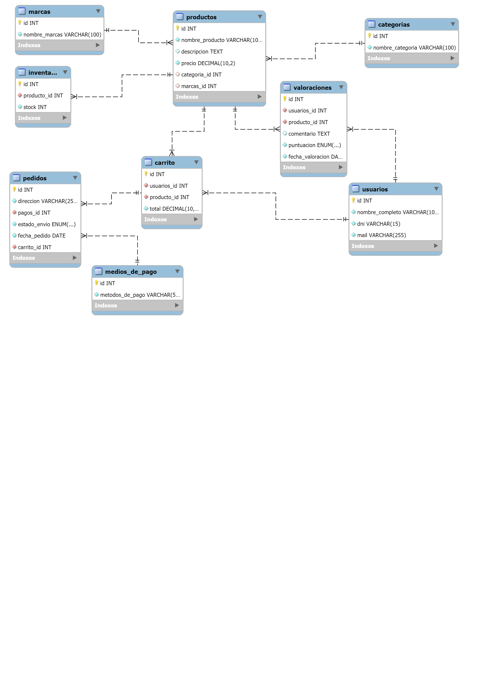

# GGStore - Base de Datos

GGStore es una tienda en línea especializada en productos de tecnología, especialmente para gamers y entusiastas de la informática. Este proyecto detalla las tablas y sus funciones dentro de la base de datos que sustenta la tienda.

## Modelo Relacional

A continuación, se presenta el diagrama de la base de datos que muestra las relaciones entre las tablas:

## Tablas Principales

### 1. `carrito`
Guarda la información de los productos que los usuarios agregan a su carrito de compra.

#### Estructura:
- `id`: Identificador único del carrito.
- `usuarios_id`: ID del usuario que posee el carrito.
- `producto_id`: ID del producto agregado.
- `total`: Total del precio del producto en el carrito.

---

### 2. `categorias`
Organiza los productos en diferentes categorías para facilitar su búsqueda.

#### Estructura:
- `id`: Identificador único de la categoría.
- `nombre_categoria`: Nombre de la categoría del producto (Ej. "Componentes de PC", "Periféricos").

---

### 3. `inventario`
Almacena los productos disponibles en la tienda. **Nota**: Actualmente está vacía.

---

### 4. `marcas`
Almacena las marcas de los productos disponibles.

#### Estructura:
- `id`: Identificador único de la marca.
- `nombre_marcas`: Nombre de la marca (Ej. "Corsair", "Razer", "Logitech").

---

### 5. `medios_de_pago`
Define los métodos de pago disponibles para los usuarios.

#### Estructura:
- `id`: Identificador único del método de pago.
- `metodos_de_pago`: Nombre del método de pago (Ej. "Tarjeta de crédito", "PayPal", "Bitcoin").

---

### 6. `pedidos`
Almacena información sobre los pedidos realizados por los usuarios.

#### Estructura:
- `id`: Identificador único del pedido.
- `direccion`: Dirección de envío.
- `pagos_id`: Método de pago utilizado.
- `estado_envio`: Estado actual del envío (Ej. "Pendiente", "Enviado", "Entregado").
- `fecha_pedido`: Fecha en la que se realizó el pedido.
- `carrito_id`: ID del carrito asociado.

---

### 7. `productos`
Contiene todos los productos disponibles para la venta.

#### Estructura:
- `id`: Identificador único del producto.
- `nombre_producto`: Nombre del producto.
- `descripcion`: Descripción del producto.
- `precio`: Precio del producto.
- `categoria_id`: Relación con la categoría del producto.
- `marcas_id`: Relación con la marca del producto.

---

### 8. `usuarios`
Contiene los datos de los usuarios registrados en GGStore.

#### Estructura:
- `id`: Identificador único del usuario.
- `nombre_completo`: Nombre completo del usuario.
- `dni`: Documento nacional de identidad del usuario.
- `mail`: Dirección de correo electrónico del usuario.

---

### 9. `valoraciones`
Almacena las valoraciones de los productos realizadas por los usuarios.

#### Estructura:
- `id`: Identificador único de la valoración.
- `usuarios_id`: ID del usuario que realiza la valoración.
- `producto_id`: ID del producto valorado.
- `comentario`: Comentario del usuario.
- `puntuacion`: Puntuación otorgada (de 1 a 10).
- `fecha_valoracion`: Fecha de la valoración.

---

## Funciones Clave

### Gestión de Carritos
- Los usuarios pueden agregar productos a su carrito, calcular el total y realizar un pedido.
- Cada carrito está asociado a un usuario y contiene productos con sus respectivos precios.

### Gestión de Pedidos
- Los pedidos pueden realizarse una vez que el usuario confirma los productos en su carrito.
- Cada pedido tiene un estado de envío, como "Pendiente", "Enviado", "Entregado" o "Cancelado".
- Los pedidos están vinculados a un carrito y a un método de pago.

### Valoración de Productos
- Los usuarios pueden dejar valoraciones con comentarios y puntuaciones, ayudando a otros compradores.

### Métodos de Pago
- GGStore ofrece múltiples métodos de pago, como tarjetas de crédito, PayPal, y Bitcoin.

### Categorías y Marcas
- Los productos están organizados en categorías y marcas, facilitando la navegación en la tienda.

---
